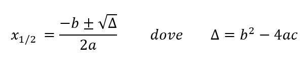

# Esercizi 04 - Funzioni

> Svolgere i seguenti esercizi definendo le funzioni richieste e svolgendo opportuni test di funzionamento.

### area-triangolo.py

Definire una funzione `area_triangolo(base, altezza)`. La funzione accetta base e altezza (in centimetri) di un triangolo e restituisce la sua area.

### somma-numeri.py

Scrivere una funzione `somma_numeri` che accetta un numero `n` e ritorna la somma di tutti i numeri interi da `1` fino a `n`.

Testare la funzione chiedendo in input il valore `n` all'utente, passarlo alla funzione e stampare il risultato.

### perfetto.py

Un numero è perfetto se è uguale alla somma dei suoi divisori escluso il numero stesso. Creare una funzione `is_perfect()` che dato un numero `x` ritorna `True` se il numero è perfetto, `False` altrimenti.

Si verifichino anche i casi particolari `x = 0` e `x = 1`.

### serie-geometrica.py

Un valore n-esimo della serie geometrica viene definito come `S(n) = 1 + q + q^2 + q^3 + ... + q^n`. Definire una funzione `serie_geometrica` che accetta i valori `n` e `q` e che calcola e restituisce il valore `S(n)`.

Chiedere i valori `n` e `q` in input all'utente forzando l'inserimento di valori positivi.

### fattoriale.py

In matematica il fattoriale di un numero `n` viene definito come `n! = n * (n-1) * (n-2) ...`. Il fattoriale di 5 per
esempio sarà `5! = 5 * 4 * 3 * 2 * 1`. Inoltre per definizione `0! = 1`.

Definire una funzione `fattoriale(n)` che accetta un numero intero positivo `n` e ne calcola il fattoriale restituendolo
come valore di ritorno.

### potenza.py

Definire una funzione `potenza(base, esponente)`. La funzione calcola la potenza con base `base` ed esponente `esponente`
restituendo il risultato. La funzione deve effettuare tutti i controlli necessari su base ed esponente (es. numeri negativi).
Per lo svolgimento di questo esercizio viene fatto divieto dell'utilizzo dell'operatore `**`.

### fizzbuzz.py

Definire una funzione `fizzbuzz` che accetta un numero `n` e stampa i valori da `1` fino a `n` ma che rimpiazza alcuni valori della sequenza come segue:
* Al posto di ciascun numero multiplo di 3 stampa `fizz`
* Al posto di ciascun numero multiplo di 5 stampa `buzz`
* Al posto di ciascun numero multiplo sia di 3 sia di 5 stampa `fizzbuzz`

Per esempio chiamando la funzione `fizzbuzz(15)` essa produrrà la sequenza:

```
1 2 3 4 5 6 7 8 9 10 11 12 13 14 15
```

Ma stamperà:

```
1 2 fizz 4 buzz fizz 7 8 fizz buzz 11 fizz 13 14 fizzbuzz
```

### equazioni.py

In matematica le soluzioni di una quazione di secondo grado del tipo `ax^2 + bx + c = 0`si calcolano tramite la seguente formula:



**IMPORTANTE**: se DELTA risulta essere minore di 0, l'equazione NON possiede soluzioni reali.

Definire una funzione `risolvi_equazione(a, b, c)` che accetta i parametri di una equazione di secondo grado e stampa su `output` le due possibili soluzioni.
Effettuare tutti i controlli opportuni sui parametri forniti e sul valore di delta calcolato.

### primo.py

Per definizione un numero `n` è **primo** se è divisibile solo per 1 e per sè stesso. Per verificare se un numero non è primo è sufficiente trovare un altro suo divisore oltre a 1 e a `n`.

Definire una funzione `is_prime(n)` che dato un numero `n` restituisce `True` se il numero è primo altrimenti restituisce `False`. Se il numero è negativo o nullo la funzione restituisce `False`.

## Funzioni e liste

### somma-multipli.py

Definire e testare una funzione che data una lista `l` di numeri interi e un numero `n`, ritorna la somma dei soli multipli di `n`.

### crivello.py

Il **crivello di Eratostene** è un metodo che permette di trovare tutti i numeri primi compresi fra 2 e `k`.

Si scriva una funzione `crivello(k)` che implementi il crivello di Eratostene come descritto di seguito.

La funzione accetta un numero `k` e ritorna la lista di tutti e soli i numeri primi presenti fra 2 e `k`. A partire da una lista vuota la funzione opera come segue:
* Per ciascun valore `i` compreso fra 2 e `k` si verifica se `i` è multiplo di uno fra i valori presenti nella lista e, nel caso, lo si scarta.
* Se il valore `i` non è presente nella allroa esso è primo e lo si aggiunge alla lista.

### filtra-nomi.py

Definire una funzione che data una lista `l` di nomi (stringhe) e un carattere `ch` ritorna una nuova lista contenente solo i nomi che iniziano con la lettera `ch`.

### tribonacci.py

La *successione di Tribonacci* è una successione di numeri in cui il numero i-esimo `F(j)` viene definito come `F(j) = F(j-1) + F(j-2) + F(j-3)` con la particolarità che `F(0) = 0`, `F(1) = 0` e `F(2) = 1`.

Scrivere una funzione che accetta un numero intero positivo `n`. La funzione calcola e inserisce in una lista tutti i numeri della successione di Tribonacci fino al numero `n`-esimo e poi ritorna la lista ottenuta.

Per esempio inserendo `n = 8` si ottiene `[0, 0, 1, 1, 2, 4, 7, 13]` ossia i primi 8 numeri della successione di Tribonacci.

### syracuse.py

La *successione di Syracuse* è una sequenza di numeri ottenuto a partire da un certo valore `x` positivo che viene modificato come segue fino a quando diventa pari a 1:
* Se `x` è pari allora esso viene dimezzato usando la divisione intera `x//2`
* Se `x` è dispari allora esso diventa `5*x + 1`

Scrivere una funzione `syracuse(x)` che accetta un numero `x` e restituisce una lista che contiene tutte le sue trasformazioni fino ad arrivare al valore 1. Se le trasformazioni effettuate sono più di 20 interrompere anticipatamente il calcolo e ritornare la lista.

Nella parte principale del programma generare una lista di 5 numeri random compresi fra 10 e 30 e, per ciascuno di essi, stampare la successione di Syracuse corrispondente restituita dalla funzione.

### filtra-parole.py

Definire una funzione che data una lista `l` di parole (stringhe) e una stringa `s` ritorna una nuova lista contenente solo le parole che iniziano con la stringa `s`.

### rimuovi-occorrenze.py

Definire una funzione `rimuovi_occorrenze(l, e)` che accetta una lista `l` e un elemento `e`. La funzione restituisce una nuova
lista dalla quale sono state rimosse tutte le occorrenze di `e`.

### intersezione.py

Scrivere un programma e inizializzare le liste seguenti:

```python
l1 = [1, 2, 3, 4, 5, 6]
l2 = [4, 5, 6, 7, 8, 9, 10]
```

Si definisca una funzione `intersezione` che accetta due liste `l1` e `l2` che restituisce una nuova lista `out` che contiene solamente gli elementi presenti sia in `l1` sia in `l2`. Perciò si otterrà `out = [4, 5, 6]`.

### dati-maggiorenni.py

Definire una funzione `dati_maggiorenni(lista)`. La funzione accetta una lista di dictionary contenenti i dati di alcune persone.
Il compito della funzione è quello di restituire una nuova lista che contenga solamente i dati delle persone maggiorenni.

Si utilizzi la lista di persone fornita di seguito per effettuare i test necessari.

```python
persone = [
    {"Nome": "Mario", "Cognome": "Rossi", "Anni": 15, "Altezza": 175},
    {"Nome": "Luigi", "Cognome": "Verdi", "Anni": 23, "Altezza": 168},
    {"Nome": "Anna", "Cognome": "Bianchi", "Anni": 56, "Altezza": 181},
    {"Nome": "Luisa", "Cognome": "Rinaldi", "Anni": 16, "Altezza": 157},
    {"Nome": "Stefano", "Cognome": "Baruzzi", "Anni": 12, "Altezza": 178},
    {"Nome": "Maria", "Cognome": "Callas", "Anni": 35, "Altezza": 190}        
]
```
