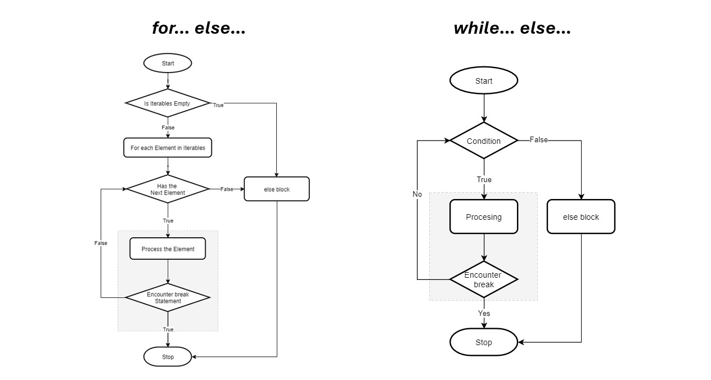

# Strutture di selezione e ripetizione

Come ogni linguaggio di programmazione python mette a disposizione vari *costrutti* o strutture che permettono di effettuare controlli o ripetere codice inserito al loro interno.

Tali strutture rappresentano i concetti di selezione e ripetizione generali trattati nel documento riferito agli algoritmi.

### Indentazione del codice

Si dice **indentazione** (o rientro) l'inserimento di una certa quantità di spazio vuoto all'inizio di una riga di testo.

```
Questa è la prima riga di testo
Questa è la seconda riga di testo indentata PARI alla prima
	Questa terza riga di testo è indentata SOTTO alla seconda riga
		Questa quarta riga di testo è indentata SOTTO alla riga precedente
Questa ultima riga è indentata PARI alla prima e alla seconda
```

>[!NOTE]
>**Nel linguaggio python l'indentazione permette di definire blocchi di codice**. Essa assume un ruolo FONDAMENTALE per lo sviluppo di programmi e per la redazione di script.


```
istruzioni iniziali

CONDIZIONE
	istruzioni da eseguire
	se si verifica la condizione

istruzioni successive
```

>[!TIP]
>In ogni caso l'indentazione è una pratica che rende il codice più leggibile, pertanto è sempre caldamente consigliato indentare correttamente il proprio codice, indipendentemente dal linguaggio di programmazione!

## Struttura di selezione - if/elif/else

La struttura di selezione `if/elif/else` accetta una certa condizione ed esegue le istruzioni specificate "al suo interno" solamente se la condizione specificata risulta vera.

```python
if condizione:
	# Istruzioni eseguite in caso di condizione VERA
else:
	# Istruzioni eseguite in caso di condizione FALSA
```

La struttura `if` permette di verificare diverse condizioni *in cascata* tramite l'utilizzo di `elif` (else if) come mostrato nel seguito.

```python
if c1:
	# Istruzioni eseguite in caso c1 sia VERA
elif c2:
	# Istruzioni eseguite in caso c1 sia FALSA ma c2 VERA
elif c3:
	# Istruzioni eseguite in caso c1 e c2 siano FALSE ma c3 VERA
else:
	# Istruzioni eseguite in caso di c1, c2, c3 tutte FALSE
```

>[!TIP]
>Quando si decide di utilizzare una struttura di selezione con `elif` è necessario considerare l'ordine delle condizioni poste in cascata: se alcune condizioni sono false, controlli successivi possono risultare inutili.

```python
x = 15

if x < 10:
	print("Il valore x è minore di 10")
elif x > 20:
	print("Il valore x è maggiore di 20")
else:
	print("Il valore di x è compreso fra 10 e 20")
```

## Struttura match case

Il **match case** è una struttura di controllo che permette di implementare il matching su una specifica variabile. La struttura è definita come segue:

```python
status = int(input("Inserire un valore di stato: "))

match status:
	case 200:
		print("200: Tutto ok!")
	case 400:
		print("500: Errore del client")
	case 500:
		print("500: Errore del server")
	case _:
		print("Codice sconosciuto")
```

Nel caso in esame viene valutato il contenuto della variabile `status` e stampato il messaggio corrispondente a tale valore.

Si noti che non essendo possibile definire tutti i casi possibili vi è l'opportunità di usare il caso `_` per stampare un certo messaggio qualora venga inserito un codice diverso da tutti quelli specificati in precedenza.

Il comportamento finale è analogo alla struttura di selezione classica `if/elif/else`.

## Strutture di ripetizione - cicli

Il ciclo `while` permette di ripetere le istruzioni contenute al suo interno fino al verificarsi di una certa condizione.

```python
# Istruzioni iniziali

while condizione:
	# Istruzioni da ripetere

# Istruzioni successive
```

Il ciclo `for` permette di ripetere le istruzioni contenute al suo interno per un numero finito di volte.

```python
# Istruzioni iniziali

for var in oggetto_iterabile:
	# Istruzioni da ripetere

# Istruzioni successive
```

>[!NOTE]
>Durante ciascuna iterazione del ciclo for la variabile di controllo `var` assume un valore differente!

```python
# Stampa di tutti i numeri da 1 fino a 9

for i in range(1, 10):
	print(i)
```

>[!TIP]
>Nella semantica del linguaggio python quando si esprimono gli estremi di un intervallo si considerano sempre i valori iniziali e finali secondo la seguente logica: **primo incluso, ultimo escluso**.

## La parola chiave `else` al termine dei cicli

L'aggiunta di della parola chiave `else` al termine di un ciclo iterativo permette di eseguire un certo blocco di istruzioni solamente se il ciclo viene completato in maniera naturale.

```python
while condizione:
    # Istruzioni del ciclo
else:
    # Istruzioni da eseguire solo se il ciclo non viene interrotto
```

```python
for var in oggetto_iterabile:
    # Istruzioni del ciclo
else:
    # Istruzioni da eseguire solo se il ciclo non viene interrotto
```



>[!TIP]
> Se viene eseguita una istruzione `break` all'interno del ciclo, questo termina in modo forzato ed il blocco `else` **NON** viene eseguito!

## Programmi a menu

Un **programma a menu** è un programma che esegue continuamente senza mai terminare, restando in attesa di un comando da parte dell'utente. In base al comando inserito il programma può eseguire istruzioni oppure terminare.

Per implementare i programmi a menu si utilizzano le seguenti componenti:
* Una variabile `comando` che contiene il comando inserito dall'utente
* Un ciclo `while` che verifica l'eventuale condizione di uscita
* Un `if...elif` oppure un `match case` per eseguire istruzioni in base al comando inserito

Il codice seguente mostra un esempio di programma a menu:

```python

# Stampe per informare l'utente sui comandi disponibili
print("Comandi:")
print("0) Uscita")
print("1) Primo comando")
print("2) Secondo comando")

# Primo input del comando
comando = int(input("Inserire un comando: "))

# Fino a quando non devo uscire... (esco quando comando == 0)
while comando != 0:

    # Controlli sul comando
    if comando == 1:
        # [Codice del comando 1]
        print("Eseguito comando 1")
    elif comando == 2:
        # [Codice del comando 2]
        print("Eseguito comando 2")
    else:
        print("Comando sconosciuto")
    
    # Stampe per informare l'utente sui comandi disponibili
    print("Comandi:")
    print("\t0) Uscita")
    print("\t1) Primo comando")
    print("\t2) Secondo comando")

    # Primo input del comando
    comando = int(input("Inserire un comando: "))

print("Fine programma")
```