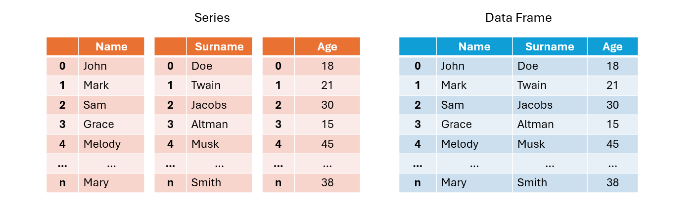

# Libreria Pandas

Pandas è una delle librerie più utilizzate in Python per l’analisi e la manipolazione dei dati.
Viene impiegata soprattutto per lavorare con dati strutturati, come tabelle. Grazie alle sue strutture dati principali,
come DataFrame e Series, pandas permette di eseguire operazioni complesse sui dati in modo intuitivo, facilitando attività
come l’analisi statistica, l’esplorazione dei dati e la preparazione dei dataset per il machine learning.

Pandas è ampiamente usata in ambiti come la data science, la ricerca scientifica, la finanza e l’ingegneria,
dove la gestione accurata dei dati è uno degli aspetti più critici e considerati per una buona riuscita dei progetti.

## Strutture dati principali

La libreria PANDAS permette di gestire dati organizzati in **tabelle indicizzate** che rappresentano il contenuto di un dataset.
La libreria mette a disposizione due strutture dati principali per operare con i dataset:

* `Series`: struttura dati (classe) composta da un elenco di chiavi dette *indici* associate a un elenco di *valori* di pari lunghezza.
* `Dataframe`: struttura dati (classe) che comprende più series aventi stessi indici. Rappresenta una tabella in cui ogni serie è una colonna avente tante righe/elementi.

