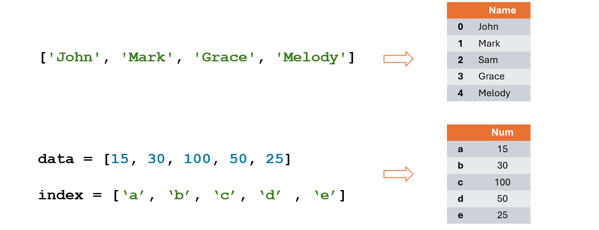
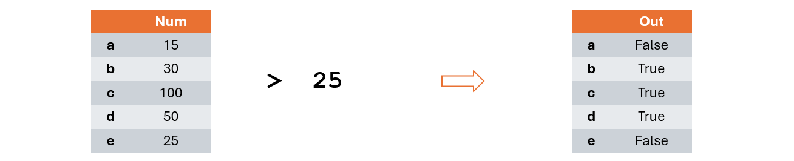
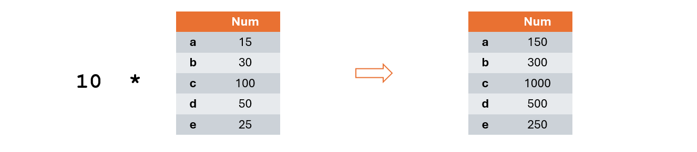
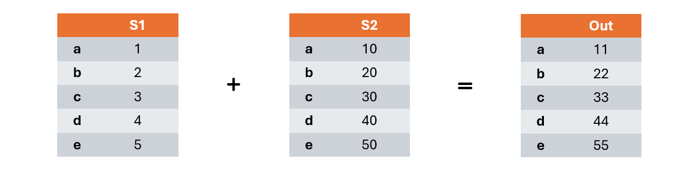
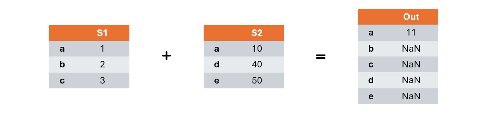
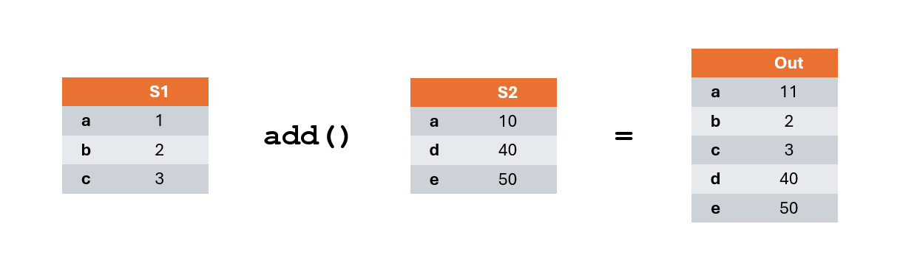
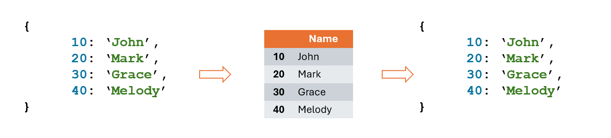

# Series

Una **serie** è una struttura dati 1-dimensionale in cui ciascun dato viene identificato da una etichetta o indice.

```python
class pandas.Series(
    data=None, index=None, dtype=None,
    name=None, copy=None, fastpath=<no_default>
)
```



## Creazione e accesso ai dati delle series

Per creare un nuovo oggetto di tipo `Series` è sufficiente invocare il costruttore della classe fornendo i parametri di
interesse. I più comuni sono:

* `data`: array-like object che contiene i dati da inserire nella serie. Se viene passato un *dictionary* allora la serie assume la stessa forma.
* `index`: array-like object che contiene gli indici da associare a ciascun elemento.
* `dtype`: tipo dei dati della serie. Se non specificato viene ricavato automaticamente dai dati.

Per accedere ai dati di un oggetto `Series` è possibile utilizzare la convenzionale notazione con `[]` effettuando operazioni
di accesso o assegnazione:

```python
import pandas as pd

# Definizione della serie
s = pd.Series(
    [30, 15, 100, 50, 25],
    ['a', 'b', 'c', 'd', 'e']
)

s['b'] = 4      # Assegnazione

print(s)        # [30, 4, 100, 50, 25]
```

Si possono anche effettuare **operazioni di slicing** usando la consueta notazione `[start:end]` per ottenere porzioni della serie.

Si faccia attenzione ai casi di utilizzo della sintassi `[start:end]` che varia il proprio comportamento se si utilizzano
indici numerici o arbitrari.

* **Indici numerici**: viene seguita la consueta logica del *primo incluso, ultimo escluso* utilizzando indicizzazione 0-based
* **Indici arbitrari**: viene seguita la logica *primo incluso, ultimo incluso* fornendo tutti gli elementi del range specificato.

```python
import pandas as pd

# Definizione della serie
s = pd.Series(
    [10, 20, 30, 40],
    ['a', 'b', 'c', 'd']
)

#Slicing iniziale
print(s['b':])        # [20, 30, 40]
print(s[1:])          # [20, 30]

# Slicing centrale
print(s['b':'c'])     # [20, 30]
print(s[1:2])         # [20]

#Slicing finale
print(s[:'c'])        # [10, 20, 30]
print(s[:2])          # [10, 20]
```

## Indici

A partire da una serie si possono estrarre singolarmente indici e dati sfruttando l'attributo `.index`:

```python
import pandas as pd

# Definizione della serie
s = pd.Series(
    [10, 20, 30, 40],
    ['a', 'b', 'c', 'd']
)

#Slicing iniziale
print(s.index)        # ['a', 'b', 'c', 'd']
```

In caso l'indice sia un array numerico creato automaticamente esso sarà di tipo `RangeIndex` altrimenti sarà di tipo `Index`.

## Operatori di confronto e broadcasting

Applicando un qualsiasi operatore confronto fra un oggetto `Series` e un valore si ottiene una nuova `Series` booleana avente stessi indici
e valori booleani che sono il risultato del confronto fra ciascun valore della serie e il valore fornito.



```python
import pandas as pd

# Definizione della serie
s = pd.Series(
    [10, 20, 30, 40],
    ['a', 'b', 'c', 'd']
)

print(s > 20)        # [false, false, true, true]
print(s == 20)       # [false, true, false, false]
```

Applicando operazioni algebriche fra una serie e un elemento, l'operazione viene applicata a ciascun elemento contenuto nella serie.
Tale operazione viene definita **broadcasting**.



```python
import pandas as pd

# Definizione della serie
s = pd.Series(
    [10, 20, 30, 40],
    ['a', 'b', 'c', 'd']
)

print(2 + s)        # [12, 22, 32, 42]
print(s - 2)        # [8, 18, 28, 38]

print(2 * s)        # [20, 40, 60, 40]
print(s / 10)       # [1, 2, 3, 4]
```

>[!NOTE]
> Il risultato delle operazioni produce sempre una **nuova serie** senza modificare MAI la serie originale.

## Presenza di un elemento in una `Series`

L'operatore `in` permette di verificare la presenza di un elemento fra gli indici di una serie:

```python
import pandas as pd

s = pd.Series([10, 20, 30, 40, 50, 100])

print(2 in s)       # True : 2 index exists
print(20 in s)      # False: 20 index does not exist
```

Per verificare se un valore è contenuto fra i valori di una serie si può sfruttare l'attributo `.values`:

```python
import pandas as pd

s = pd.Series([10, 20, 30, 40, 50, 100])

print(2 in s.values)       # False : 2 is not in [10, 20, 30, 40, 50, 100]
print(20 in s.values)      # True: 20 is in [10, 20, 30, 40, 50, 100]
```

Si possono anche sfruttare delle *mask-series* ottenute dal confronto con singoli elementi e il metodo `.any()` per verificare se un certo
elemento è contenuto nei valori della serie:

```python
import pandas as pd

s = pd.Series([10, 20, 30, 40, 50, 100])

out = (s == 30).any()
print(out)              # True : there is any 30 into the serie

out = (s == 80).any()
print(out)              # False : there is not any 80 into the serie
```

## Operazioni fra `Series`

Date due diverse serie `S1` e `S2` aventi **stessi indici** è possibile eseguire le consuete operazioni `+` `-` `*` `/`
applicandole fra elementi aventi gli stessi indici.



```python
import pandas as pd

s1 = pd.Series([1, 2, 3, 4])
s2 = pd.Series([10, 20, 30, 40])

print(s2 + s1)      # [11, 22, 33, 44]
print(s2 - s1)      # [9, 18, 27, 36]
```

Quando le serie `s1` e `s2` hanno indici differenti viene prodotto una nuova serie che comprende tutti gli indici delle
serie di partenza e avente valori:
* Pari al risultato dell'operazione se gli indici esistono in entrambe le serie
* `NaN` se l'indice esiste solamente in una delle serie



```python
import pandas as pd

s1 = pd.Series([1, 2, 3], ['a', 'b', 'c'])
s2 = pd.Series([10, 40, 50], ['a', 'd', 'e'])

print(s2 + s1)      # [11, NaN, NaN, NaN, NaN]
                    # ['a', 'b', 'c', 'd', 'e']
```

Il metodo `.add()` permette di effettuare correttamente la somma portando i valori sconosciuti a un valore definito tramite
il parametro `fill_value`:

```python
import pandas as pd

s1 = pd.Series([1, 2, 3], ['a', 'b', 'c'])
s2 = pd.Series([10, 40, 50], ['a', 'd', 'e'])

print(s2.add(s1, fill_value=0))     # [11, 2, 3, 40, 50]
                                    # ['a', 'b', 'c', 'd', 'e']

print(s2.add(s1, fill_value=5))     # [11, 7, 8, 45, 55]
                                    # ['a', 'b', 'c', 'd', 'e']
```



>[!NOTE]
> Per ulteriori metodi per le operazioni si consulti la [documentazione ufficiale](https://pandas.pydata.org/docs/reference/series.html).

## Series e dictionary

`Series` e `dictionary` sono strutture dati estremamente simili perciò è possibile passare agevolmente da una struttura all'altra:

* `Dictionary -> Series`: si passa il dictionary al costruttore della serie. Viene creata una seri avente come indici le
chiavi del dictionary e come dati i valori del dictionary.
* `Series -> Dictionary`: chiamando il metodo `.to_dict()` di una serie si ottiene un dictionary avente chiavi uguali agli indici
della serie e valori uguali ai dati della serie.



```python
import pandas as pd

# From dictionary to Series
data = {
    10: 'John', 20: 'Mark',
    30: 'Grace', 40: 'Melody'
}

s1 = pd.Series(data)
print(s1)

# From Series to dictionary
s2 = pd.Series([10 ,20, 100, 50, 30])

out = s2.to_dict()
print(out)
```