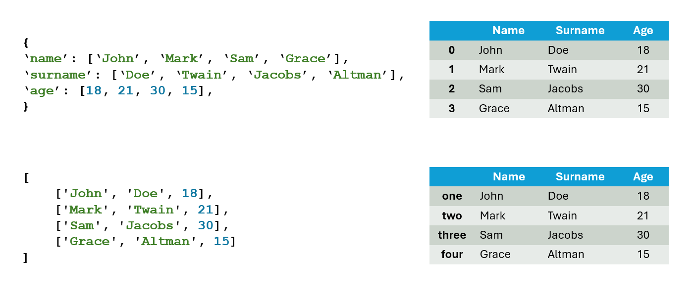
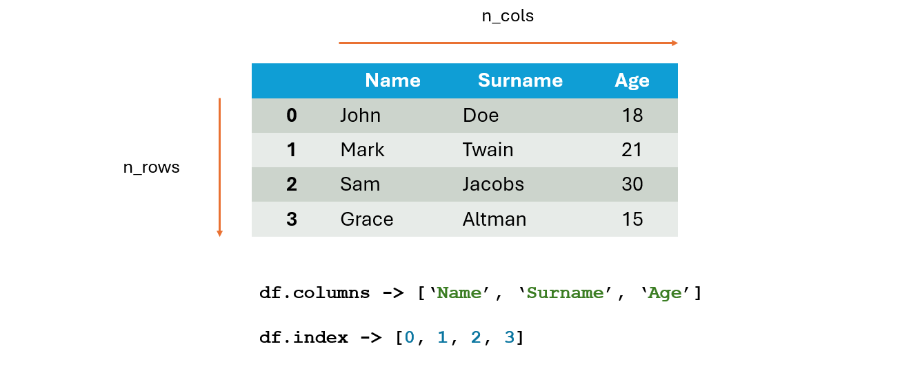
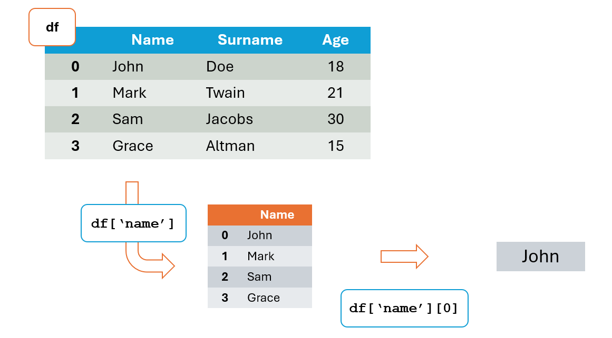
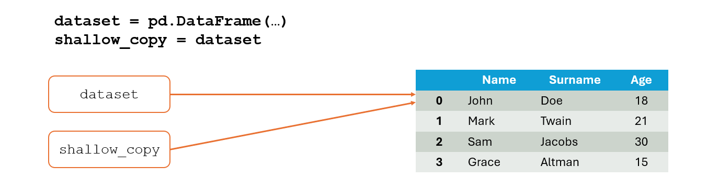
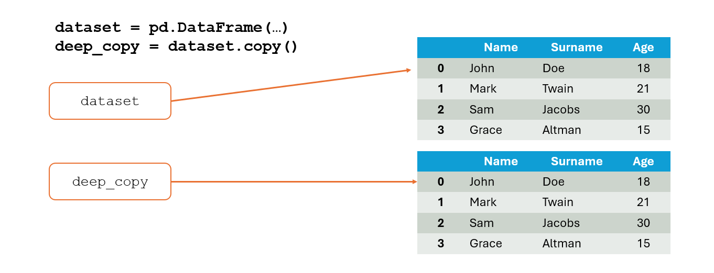
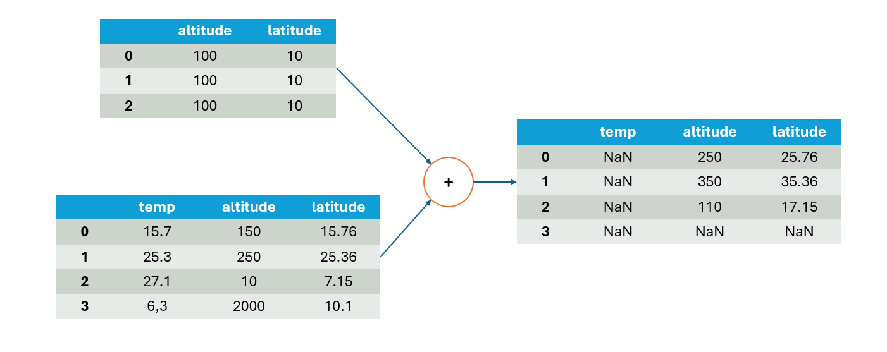
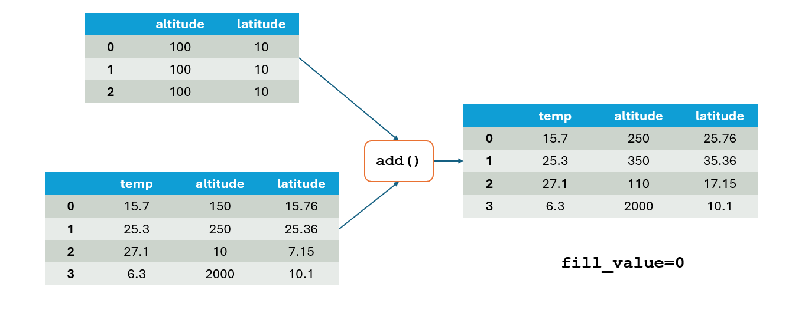

# Dataframe

Un **DataFrame** è una struttura dati in cui:
* Ciascuna colonna è un oggetto `Series`
* Ciascuna riga è un ogetto `Series`

```python
class pandas.DataFrame(
    data=None, index=None, columns=None,
    dtype=None, copy=None
)
```

## Creazione e accesso ai dati di un DataFrame

Per creare un nuovo oggetto di tipo `DataFrame` è sufficiente invocare il costruttore della classe fornendo i parametri di
interesse. I più comuni sono:

* `data`: dictionary le cui chiavi sono i nomi delle colonne e i cui valori sono array con i dati di ciascuna colonna.
* `index`: array che contiene gli indici (solitamente numerici) delle righe. Se non fornito viene generato un range di indici.
* `columns`: array che contiene gli indici (nomi) delle colonne. Se non fornito viene generato un range di indici.



Solitamente le chiavi del dictionary rappresentano i nomi delle colonne mentre i valori sono array paralleli che contengono
i dati di ciascuna riga.

```python
import pandas as pd

data = {'name': ['John', 'Mark', 'Sam', 'Grace', 'Bob', 'Eve'],
        'surname': ['Doe', 'Twain', 'Jacobs', 'Altman', 'Clark', 'Light'],
        'age': [18, 21, 30, 15, 32, 27]
}

df = pd.DataFrame(data)
print(df)
```

Il codice stamperà:

```
    name surname  age
0   John     Doe   18
1   Mark   Twain   21
2    Sam  Jacobs   30
3  Grace  Altman   15
4    Bob   Clark   32
5    Eve   Light   27
```

In alcuni casi, tuttavia, è possibile che i dati posseduti siano sotto-forma di righe. Diventano quindi utili i parametri
`index` e `columns`:

```python
import numpy as np
import pandas as pd

data = np.array([
    ['John', 'Doe', 18],
    ['Mark', 'Twain', 21],
    ['Sam', 'Jacobs', 30],
    ['Grace', 'Altman', 15]
])

df = pd.DataFrame(data=data, columns=['name', 'surname', 'age'])
print(df)
```

>[!NOTE]
> Se si voglio definire arbitrariamente gli indici di riga o di colonna è necessario che l'array passato come parametro sia di pari lunghezza
> al numero di record del dataset. In caso contrario si ottiene un errore.

### Attributi dei dataframe

Ogni dataframe ha un certa dimensione in termini di righe e colonne ottenibile tramite l'attributo `.shape` che fornisce
una tupla del tipo `(n_rows, n_cols)`.

L'attributo `.columns` contiene gli indici delle colonne del dataframe. L'attributo `.index` contiene gli indici delle righe
del dataframe (spesso definiti in automatico)

```python
print(df.shape)      # (4, 3)
print(df.index)      # Range(0, 4)
print(df.columns)    # ['name', 'surname', 'age']
```



### Metodi dei dataframe

* `.head(n)`: permette di accedere alle prime `n` righe del dataframe. Per default `n = 5`.
* `.tail(n)`: permette di accedere alle ultime `n` righe del dataframe. Per default `n = 5`.
* `.sample(n)`: permette di campionare casualmente `n` righe dal dataframe. Per default `n = 1`.

```python
import pandas as pd

data = {'name': ['John', 'Mark', 'Sam', 'Grace', 'Bob', 'Eve'],
        'surname': ['Doe', 'Twain', 'Jacobs', 'Altman', 'Clark', 'Light'],
        'age': [18, 21, 30, 15, 32, 27]
}

df = pd.DataFrame(data)

print(df.head(2))       # [['John', 'Doe', 18], ['Mark', 'Twain', 21]]
print(df.tail(2))       # [['Bob', 'Clark', 32], ['Eve', 'Light', 27]]
print(df.sample(2))     # [[?, ?, ?], [?, ?, ?]]

```

### Accesso ai valori del DataFrame

Per ricavare una colonna del dataframe è possibile utilizzare la notazione con `[]` ottenendo come valore di ritorno
un oggetto di tipo `Series`.

Alla serie appena ottenuta è possibile applicare nuovamente la notazione `[]` per estrarre l'elemento presente a un certo indice.



```python
import pandas as pd

data = {'name': ['John', 'Mark', 'Sam', 'Grace', 'Bob', 'Eve'],
        'surname': ['Doe', 'Twain', 'Jacobs', 'Altman', 'Clark', 'Light'],
        'age': [18, 21, 30, 15, 32, 27]
}

df = pd.DataFrame(data)

print(df['name'])       # ['John', 'Mark', 'Sam', 'Grace', 'Bob', 'Eve']
print(df['name'][0])    # 'John'
```

Per gestire in maniera **sicura e veloce** l'accesso a record del dataframe è bene usare gli attributi `.loc` e `.iloc`:
* `.loc`: permette di accedere a record i cui indici sono specificati esplicitamente
* `.iloc`: permette di accedere a record i cui indici sono specificati implicitamente

```python
import pandas as pd

data = {'name': ['John', 'Mark', 'Sam', 'Grace', 'Bob', 'Eve'],
        'surname': ['Doe', 'Twain', 'Jacobs', 'Altman', 'Clark', 'Light'],
        'age': [18, 21, 30, 15, 32, 27]
}

df = pd.DataFrame(
    data=data,
    columns=['name', 'surname', 'age', 'height'],
    index=['one', 'two', 'three', 'four', 'five', 'six']
)

print(df.loc['one'])          # ['John', Doe, 18, NaN]
print(df.iloc['one'])         # Error
print(df.iloc[0])             # ['John', Doe, 18, NaN]
```

L'attributo `.loc` supporta le operazioni di slicing su più dimensioni tramite la notazione `[start:end,start:end]` dove
vengono specificati rispettivamente gli indici di RIGA e di COLONNA:

```python
print(df.loc['two', 'name':'age'])
```

Produrrà l'output seguente:

```
name        Mark
surname    Twain
age           21
Name: two, dtype: object
```

Restano valide le osservazioni riguardanti lo slicing effettuate sulle `series`.

### Operatori di confronto e DataFrame

L'utilizzo di operatori di confronto `>`, `<`, `==` su un dataframe produce un dataframe booleano in cui ciascun valore è il risultato
del confronto.

```python
import pandas as pd

data = {
    'a': [1, 2, 3],
    'b': [4, 5, 6],
    'c': [7, 8, 9]
}

df = pd.DataFrame(data)

print(df > 5)
```

```
       a      b     c
0  False  False  True
1  False  False  True
2  False   True  True
```

Una volta ottenuti due dataframe booleani è possibile applicarvi gli operatori binari `&` e `|`:

```python
import pandas as pd

data = {
    'a': [1, 2, 3],
    'b': [30, 20, 10],
    'c': [100, 200, 300]
}

df = pd.DataFrame(data)

print((df >= 10) & (df <= 100))
print()
print((df <= 10) | (df >= 100))
```

## Modifica dei valori di un DataFrame

Per modificare i valori di un dataframe è possibile usare la consueta assegnazione sfruttando l'operatore `=`:

```python
import pandas as pd

data = {
    'name': ['John', 'Mark', 'Jane'],
    'surname': ['Doe', 'Smith', 'Clark'],
    'age': [18, 22, 16]
}

df = pd.DataFrame(data)

# Modifying dataset
df.loc[0] = ['Grace', 'Bloom', 30]     # Replacing row: OK

df.loc[1, 'name'] = 'Will'             # Recommended
df['name'][1] = 'Will'                 # Works but NOT recommended
df.loc[1]['name'] = 'Will'             # Does NOT work

print(df)
```
### Aggiunta di righe

Quando viene utilizzata l'assegnazione con un indice di riga inesistente allora viene aggiunto un nuovo record al dataset avente
tale indice di riga:

```python
# Adding a new row
df.loc['rx'] = ['Felix', 'Harp', 22]
```

//TODO

### Re-indexing su colonne

L'attributo `.reindex(columns, fill_value)` permette di ridefinire gli indici attuali con un nuovo set di indici ed eventualmente di aggiungerne di nuovi.

I valori del dataframe associati al nuovo indice vengono definiti automaticamente con `NaN` oppure con il valore assegnato
al parametro `fill_value`.

```python
import pandas as pd

data = {
    'a': [100, 100, 100],
    'b': [200, 200, 200],
    'c': [300, 300, 300]
}

dataset = pd.DataFrame(data)
dataset = dataset.reindex(columns=['a', 'b', 'c', 'd'])
dataset = dataset.reindex(columns=['e', 'a', 'b', 'c', 'd'], fill_value=10)

print(dataset)
```

### Eliminazione di dati dal DataFrame

Il metodo `.drop(subset, axis, inplace)` fornisce un nuovo dataframe dal quale vengono eliminati dati specificati
attraverso i prametri forniti.

* `subset`: array che specifica quale subset di indici eliminare
* `axis`: specifica in quale dimensione eliminare il subset (0 = righe, 1 = colonne)
* `inplace`: specifica se applicare le modifiche al dataframe corrente senza riassegnazione quando è `True`

```python
import pandas as pd

data = {
    'a': [100, 100, 100],
    'b': [200, 200, 200],
    'c': [300, 300, 300]
}

dataset = pd.DataFrame(data)
dataset.drop([0], inplace=True)
dataset.drop(['c'], axis=1, inplace=True)

print(dataset)
```

```
     a    b
1  100  200
2  100  200
```

### Shallow copy e deep copy

Ciascun dataframe viene identificato tramite un riferimento di memoria (puntatore) salvato all'interno di una variabile.

Quando si tenta di copiare un dataframe si può procedere in due modi:
* **Shallow copy**: viene copiato solamente il riferimento al DataFrame. Qualsiasi modifica al DataFrame si ripercuote su entrambi i riferimenti.



* **Deep copy**: viene generato un nuovo DataFrame con il proprio riferimento e tutti i dati originali vengono copiati. Si ottengono due oggetti ben distinti.



Il metodo `.copy()` dei DataFrame permette di generare una deep copy del dataframe da cui viene invocato.

L'esempio seguente mostra la differenza fra shallow copy e deep copy:

```python
import pandas as pd

data = {
    'name': ['John', 'Mark', 'Jane'],
    'surname': ['Doe', 'Smith', 'Clark'],
    'age': [18, 22, 16]
}

dataset = pd.DataFrame(data)
print(dataset)

# Copying dataset
shallow_copy = dataset
deep_copy = dataset.copy()

# Modifying dataset
dataset['age'][0] = 30

print(dataset['age'][0])            # 30
print(shallow_copy['age'][0])       # 30
print(deep_copy['age'][0])          # 18

print('----------------------------------------')

# Modifying copies
shallow_copy['age'][0] = 20
deep_copy['age'][0] = 50

print(dataset['age'][0])            # 20
print(shallow_copy['age'][0])       # 20
print(deep_copy['age'][0])          # 50
```

## Operazioni su DataFrame

Proprio come avviene per le series anche quando si tenta di eseguire operazioni fra dataframe viene effettuato il match
sia fra indici di riga sia fra indici di colonna. In assenza di match i valori risultanti diventano `NaN`.



Il metodo `.add()` assieme al parametro `fill_value` permette di evitare la presenza di valori `NaN` in caso di mancato match
fra indici di riga o di colonna.



Il codice seguente mostra un ulteriore esempio delle varie casistiche:

```python
import pandas as pd

data1 = {
    'a': [100, 100, 100],
    'b': [200, 200, 200],
    'c': [300, 300, 300]
}

data2 = {
    'b': [10, 20, 30],
    'd': [400, 400, 400]
}

f1 = pd.DataFrame(data1)
f2 = pd.DataFrame(data2)

print(f1 + f2)

print(30*'-')

sum = f1.add(f2, fill_value=0)
print(sum)
```

```
    a    b   c   d
0 NaN  210 NaN NaN
1 NaN  220 NaN NaN
2 NaN  230 NaN NaN
------------------------------
       a    b      c      d
0  100.0  210  300.0  400.0
1  100.0  220  300.0  400.0
2  100.0  230  300.0  400.0
```

>[!NOTE]
> Per ulteriori metodi per le operazioni si consulti la [documentazione ufficiale](https://pandas.pydata.org/docs/reference/series.html).

## Statistiche su DataFrame

* `describe()`: fornisce informazioni statistiche su ciascuna colonna del dataframe (count, max, min, mean...)
* `info()`: fornisce il contatore di valori non nulli per ciascuna colonna e il tipo di elementi

```python
import pandas as pd

data = {
    'a': [100, 100, 100],
    'b': [200, 200, 200],
    'c': [300, 300, 300]
}

df = pd.DataFrame(data)

print(df.describe())
print(df.info())
```

```
# Risultato di .describe()

           a      b      c
count    3.0    3.0    3.0
mean   100.0  200.0  300.0
std      0.0    0.0    0.0
min    100.0  200.0  300.0
25%    100.0  200.0  300.0
50%    100.0  200.0  300.0
75%    100.0  200.0  300.0
max    100.0  200.0  300.0

# Risultato di .info()

RangeIndex: 3 entries, 0 to 2
Data columns (total 3 columns):
 #   Column  Non-Null Count  Dtype
---  ------  --------------  -----
 0   a       3 non-null      int64
 1   b       3 non-null      int64
 2   c       3 non-null      int64
dtypes: int64(3)
memory usage: 204.0 bytes
```
---

* `sum()`: esegue la somma di tutti gli elementi di una certa riga (`axis = 1`) o colonna (`axis = 0`)
* `prod()`: esegue il prodotto di tutti gli elementi di una certa riga (`axis = 1`) o colonna (`axis = 0`)

---

* `min()`: fornisce il valore minimo per ogni serie dell'asse specificato.
* `max()`: fornisce il valore massimo per ogni serie dell'asse specificato.
* `idxmin()`: fornisce l'indice del valore minimo per ogni serie dell'asse specificato.
* `idxmax()`: fornisce l'indice del valore massimo per ogni serie dell'asse specificato.

Si noti che specificando `axis=0` si ricerca il min/max per ciascuna riga mentre con `axis=1` si effettua la ricerca
per ciascuna colonna.


```python
import pandas as pd

data = {
    'a': [1, 2, 3],
    'b': [30, 20, 10],
    'c': [100, 200, 300]
}

df = pd.DataFrame(data)
print(df)

max_v_rows = df.max(axis=1)
print(max_v_rows)

min_v_cols = df.min(axis=0)
print(min_v_cols)
```

```
# DataFrame

 a   b    c
0  1  30  100
1  2  20  200
2  3  10  300

# Max for each row

0    100
1    200
2    300

# Min for each column

a      1
b     10
c    100

# Min element index for each column

a    0
b    2
c    0

```
---

* `unique()`: restituisce un array contenente tutti i valori possibili che compaiono in una serie
* `value_counts()`: restituisce una serie che fornisce il conteggio delle occorrenze di ciascun valore nella serie

// TODO ESEMPIO