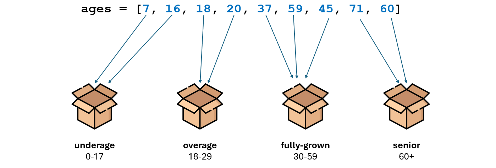
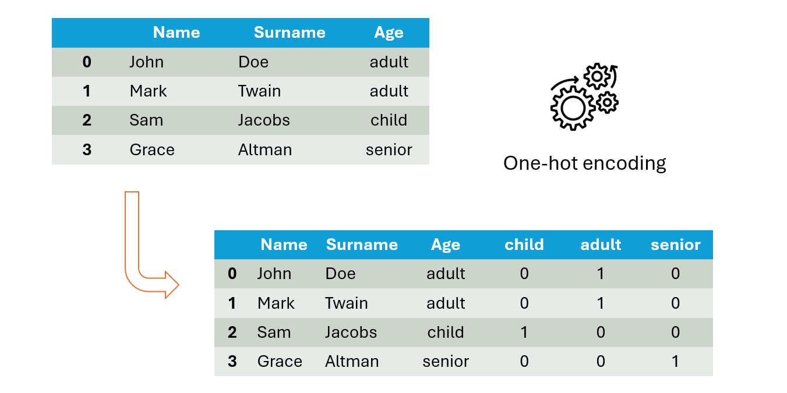
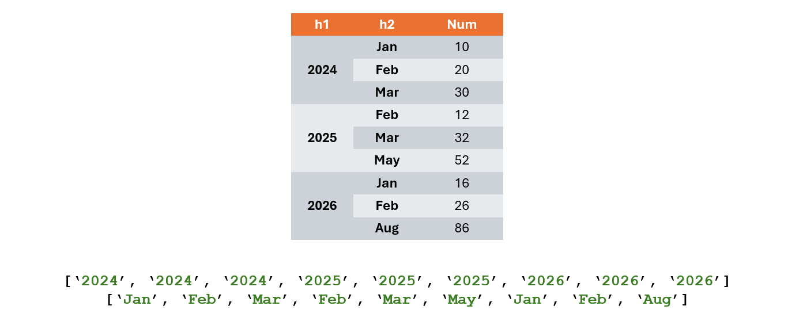
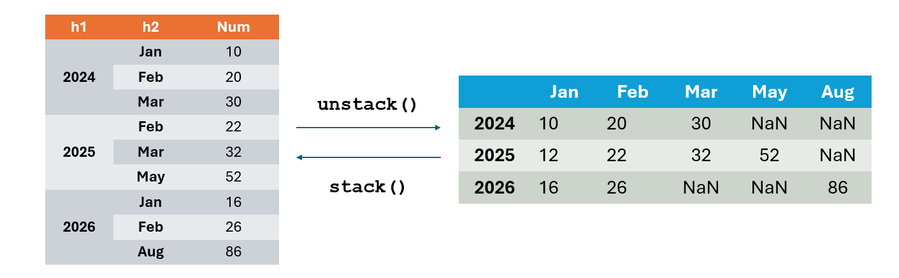

# Data management

Molto spesso i dati vengono salvati in file `.csv` o `.xlsx`. Tali file permettono di codificare i dati secondo una struttura
di righe e colonne e sono facilmente convertibili in dataframe pandas.

Nei file `.csv` la prima riga contiene le intestazioni di colonna mentre le righe successive contengono i valori dei dati.
Tutti i valori sono separati da **caratteri separatori** come `,` o `;`.

```csv
ID;Nome;Cognome;Età
101;Mario;Rossi;45
102:Luisa;Bianchi;32
103;Giovanni;Verdi;50
```

## Caricamento dei dati

```python
pandas.read_csv(
    filepath_or_buffer, sep=<no_default>,
    header=None, names=[], index_col='col_name',
    skiprows=[], nrows=n 
)
```

* `filepath_or_buffer`: stringa che identifica l'indirizzo del file all'interno del file system o una sorgente dati.
* `sep`: carattere separatore usato all'interno del file `.csv`.
* `header`: specifica quale riga contiene i nomi delle colonne. Solitamente si ha `header=0`, quando non ci sono intestazioni si ha `header=None`.
* `names`: array che specifica i nopmi delle colonne in caso di assenza dell'intestazione all'interno del file.
* `index_col`: permette di specificare quale colonna del file usare come indice di riga al posto del convenzionale range.
* `skiprows`: specifica quante `n` righe iniziali o gli indici delle righe da saltare.
* `nrows`: specifica quante righe leggere dal file in caso sia di dimensione molto grande.

Consideriamo il file `.csv` proposto in precedenza e lanciamo la funzione `read_csv()`:

```python
import pandas as pd

path = "data/people.csv"
df = pd.read_csv(
    path, sep=';', skiprows=[2], index_col='ID'
)

print(df)
```
```
         Nome Cognome  Età
ID                        
101     Mario   Rossi   45
103  Giovanni   Verdi   50
```

## Gestione dei missing values

Un **missing value** è un dato assente o non disponibile all’interno di un dataset. 
In pratica, indica che per una certa osservazione non esiste un valore valido per una variabile.

Prima che i dati vengano utilizzati è buona norma applicare tecniche di gestione dei missing values.

### Eliminazione di missing values

I valori assenti nel dataset possono essere rappresentati come `NaN` sia `Null`. Esistono due metodi che permettono di rilevare
i dati nulli:

* `.isnull()`: restituisce un dataframe con valore `True` ogni volta che un dato **è nullo**, `False` altrimenti.
* `.notnull()`: restituisce un dataframe con valore `True` ogni volta che un dato **NON è nullo**, `False` altrimenti.

Per ottenere il sottoinsieme di colonne con valori non nulli si può usare `data[data.notnull()]` oppure il metodo `.dropna()`.

```python
DataFrame.dropna(
    axis=0, how=<no_default>, thresh=<no_default>,
    subset=None, inplace=False, ignore_index=False
)
```

Di default il metodo elimina tutte le righe all'interno delle quali è presente un missing value. Specificando 
opportuni parametri è possibile modificarne il comportamento.

* `axis`: permette di eseguire l'operazione di drop solo su righe (`axis=0`) o solo su colonne (`axis=1`). Di default si ha `axis=0`.
* `thresh`: specifica il numero minimo di valori nulli che una riga/colonna deve contenere per essere eliminata.
* `inplace`: permette la modifica inplace senza necessità di riassegnazione.
* `how`: permette di applicare condizioni sull'eliminazione:
   * `how='all'`: elimina le righe/colonne con tutti i valori nulli
   * `how='any'`: elimina le righe/colonne con almeno un valore nullo

Per comprendere il funzionamento del metodo `.dropna()` si esegua il codice sottostante e si osservino i risultati:

```python
import numpy as np
import pandas as pd

df = pd.DataFrame([
    [1., 6.5, 3.],
    [np.nan, np.nan, np.nan],
    [np.nan, np.nan, 2.0],
    [np.nan, 6.5, 3.0]
    ],
    columns=['a', 'b', 'c']
)
print(df, '\n')

print(df.dropna(how='all'), '\n')
print(df.dropna(axis=1, thresh=2), '\n')
```

### Rimpiazzamento di missing values

Il metodo `.fillna(replace_dict)` permette di riempire i valori nulli con valori definiti in un dictionary passato come argomento.

>[!NOTE]
> Il metodo restituisce il riferimento a un nuovo dataframe al quale è stato applicato il rimpiazzamento lasciando
> invariato il dataframe originale. Per applicare le modifiche al dataframe originale bisogna impostare il parametro `inplace=True`.

```python
import numpy as np
import pandas as pd

df = pd.DataFrame([
    [1., 6.5, 3.0],
    [1., np.nan, np.nan],
    [np.nan, np.nan, 2.0],
    [np.nan, 6.5, 3.0]
    ],
    columns=['a', 'b', 'c']
)
print(df, '\n')

print(df.fillna(
    {'a': 0.5, 'b': 0.7, 'c': 0}
))
```

In alcuni casi si possono riempire tutti i valori non nulli con l'ultimo valore non nullo. Il metodo è efficace quando i
valori nulli sono pochi o molto *vicini fra loro*.

> **Esempio**: si pensi a un sensore che rileva la temperatura atmosferica ogni 5 secondi e produca missing values. Si può supporre che
> la temperatura non subisca grandi variazioni nell'arco di 5 secondi.

Si può usare il metodo `.ffill(limit)` permettono di rimpiazzare un certo numero `limit` di missing
values con i valori del record in cui il dato è presente.

```python
import numpy as np
import pandas as pd

df = pd.DataFrame({
    'time': range(1000, 1008),
    'temp': [15.7, np.nan, np.nan, np.nan, 16.0, 15.5, np.nan, 15.4]
})
print(df, '\n')
print(df.ffill(limit=2))
```

## Correlazione

### Correlazione fra colonne

Il metodo `corr()` permette di calcolare la correlazione fra due colonne numeriche di un dataframe in modo da capire se due feature del dataset mutano in maniera correlata. Il valore di correlazione è compreso in `[-1, 1]` e ha i seguenti significati:

* `+1`: correlazione positiva perfetta. I due valori mutano insieme.
* `0`: nessuna correlazione fra le feature.
* `-1`: correlazione negativa perfetta. I due valori cambiano in maniera opposta.

La funzione restituisce una **matrice di correlazione** con feature ordinate in cui ogni cella contiene il valore di correlazione fra le feature dalle quali è identificata. Ovviamente la diagonale ha sempre valore 1 poiché indica la correlazione fra una feature e sé stessa.

```python
import pandas as pd

df = pd.DataFrame({
    'study_time': [1, 2, 3, 4, 5],
    'vote': [18, 20, 22, 25, 28],
    'sex': [0, 0, 1, 1, 0]   # 0 = male, 1 = female
})

print(df.corr())
```

### Tabella di contingenza

Una **tabella di contingenza** mostra la relazione fra due o più variabili categoriche mostrando quatnte osservazioni del dataset cadono all'interno di ciascuna categoria.

Ogni tabella di contingenza si occupa di gestire due variabili `A` e `B` e possiede:
* Tante righe quante sono le categorie di `A`
* Tante colonne quante sono le categorie di `B`

I dati possono essere visualizzati sotto-forma di semplice conteggio oppure di percentuale per riga/colonna.

Il metodo `crosstab(feature, target)` permette di ottenere la tabella di contingenza fra due variabili categoriche di un dataframe passate come argomento.
* Il parametro `normalize` permette di eseguire la normalizzazione (valori percentuali)
  * `normalize='index'` = esegue la normalizzazione sulle righe (ossia su `feature`)
  * `normalize='columns'` = esegue la normalizzazione sulle colonne (ossia su `target`)
  * `normalize='all'` = esegue la normalizzazione fra tutti i valori
* Il parametro `margins` permette di mostrare i totali di righe e colonne

```python
import pandas as pd

df = pd.DataFrame({
    "Sesso": ["M", "F", "F", "M", "M", "F", "M", "F"],
    "Esame_superato": ["Sì", "No", "Sì", "Sì", "No", "No", "Sì", "Sì"]
})

tab = pd.crosstab(df["Sesso"], df["Esame_superato"], normalize='index', margins=True) * 100
print(tab)
```
```
Esame_superato    No    Sì
Sesso                     
F               50.0  50.0      -> Le femmine superano esame il 50% delle volte
M               25.0  75.0      -> I maschi superano l'esame il 75% delle volte
All             37.5  62.5
```

## Trasformazione dei dati

### Rimozione dei duplicati

La libreria pandas mette a disposizione alcuni metodi per la gestione di record duplicati:
* `.duplicated()`: fornisce un series con valori `True` se una riga è duplicata di un'altra che la precede.
* `.drop_duplicates(subset=['a', 'c'], keep='last')`: rimuove i record con valori duplicati per certe colonne e conservando
l'ultima occorrenza. Se non viene specificato un `subset` viene effettuato il controllo su tutti i valori.

Per comprendere meglio il funzionamento dei metodi si esegua l'esempio di codice proposto:

```python
import pandas as pd

df = pd.DataFrame(
    {
        'id': [100, 101, 102, 100, 104, 105],
        'amount': [55, 65, 65, 55, 70, 80],
        'time': [0.0, 1.0, 1.0, 0.0, 2.0, 2.5]
    }
)

print(df, '\n')
print(df.duplicated(), '\n')
print(df.drop_duplicates(keep='last'), '\n')
print(df.drop_duplicates(subset=['amount']), '\n')
```

### Mapping

Il metodo `map()` permette di applicare una funzione che le viene passata a tutti gli elementi di una serie sulla quale viene invocata.

```python
import pandas as pd

data = pd.DataFrame({
  'username': ['john.doe', 'mary.rose', 'mark-twain'],
  'age': [15, 27, 18]
})


def mapping_method(x):
  return x > 18

data['overage'] = data['age'].map(mapping_method)
print(data)
```

### Sostituzione dei dati

Il metodo `.replace()` permette di rimpiazzare valori contenuti nel dataframe con valori specificati. Si può invocare in due
modi differenti in base ai parametri passati.

* `.replace([v1, v2], new_v)` sostituisce i valori `v1, v2` con `new_v`,
* `.replace({v1: new_v1, v2: new_v2})` sostituisce i valori `v1, v2` rispettivamente con `new_v1, new_v2`.

```python
import pandas as pd

df = pd.DataFrame(
    {
        'id': [100, 101, 102, 100, 104, 105],
        'amount': [55, 65, 65, 55, 70, 80],
        'time': [0.0, 1.0, 1.0, 0.0, 2.0, 2.5]
    }
)

print(df, '\n')
print(df.replace([55, 65], 0), '\n')
print(df.replace({55: 0, 65: 1}), '\n')
```

### Discretizzazione

Si dice **discretizzazione** l'operazione di suddivisione di valori continui all'interno di gruppi discreti.



Il metodo `pd.cut()` permette di effettuare la discretizzazione di valori di un dataset.

```python
pandas.cut(
  x, bins, right=True, labels=None,
  retbins=False, precision=3, include_lowest=False,
  duplicates='raise', ordered=True
)
```

* `x`: oggetto su cui applicare la discretizzazione. Array-like object.
* `bins`: specifica il numero di intervalli in cui suddividere i dati oppure gli intervalli stessi:
  * Se `bins=n` i dati vengono divisi in `n` intervalli di egual dimensione.
  * Se `bins=[a, b, c, ...]` i dati vengono suddivisi in intervalli del tipo `(a, b], (b, c], ...`.
* `right`: specifica se chiudere l'intervallo a destra. In caso `right=False` si ottengono intervalli del tipo `[a, b)`.
* `labels`: specifica le etichette corrispondenti a ciascun intervallo.

> **Esempio:** si supponga di voler associare a ogni persona una categoria in base alla fascia di età a cui appartiene.
> Il codice di seguito riportato mostra l'utilizzo del metodo `.cut()`.

```python
import pandas as pd

df = pd.DataFrame({
    "name": ["John", "Mary", "Mark", "Rose", "Paul"],
    "age": [18, 22, 35, 40, 60]
})

df["age_category_right"] = pd.cut(
    df["age"],
    bins=[0, 18, 30, 50, 100],
    labels=["underage", "adult", "fully-grown", "senior"],
    right=True
)

df["age_category_left"] = pd.cut(
    df["age"],
    bins=[0, 18, 30, 50, 100],
    labels=["underage", "adult", "fully-grown", "senior"],
    right=False
)

print(df)
```

Se viene passato un array, il metodo `.cut()` ritorna un oggetto con due proprietà:
* `codes`: lista per ogni elemento con indice dell'intervallo di appartenenza
* `categories`: gli intervalli veri e propri come IntervalIndex

```python
import pandas as pd

ages = [20, 22, 25, 27, 21, 23, 37, 31, 59, 45, 41, 32]
bins = [18, 25, 35, 60, 100]
out = pd.cut(ages, bins)

print(out.codes)            # [0 0 0 1 0 0 2 1 2 2 2 1]
print(out.categories)       # [(18, 25], (25, 35], (35, 60], (60, 100]]
```

### One Hot Encoding

**One-hot encoding**: tecnica che data una colonna k-categorica genera un dataframe di `k` colonne con valori binari dove 
ogni riga contiene valore `1` solo se il record appartiene alla categoria.



Il metodo `pd.get_dummies(df['col'], prefix='key')` permette di eseguire il one-hot encoding su una certa feature categorica
permettendo di definire un prefisso per le colonne di one-hot.

Poiché il metodo ritorna solamente le colonne di one-hot è possibile sfruttare `DataFrame.join(joined)` per unire il 
dataset originale e le colonne di one-hot.

```python
import pandas as pd

data = {'name': ['John', 'Mark', 'Sam', 'Grace', 'Bob', 'Eve'],
        'surname': ['Doe', 'Twain', 'Jacobs', 'Altman', 'Clark', 'Light'],
        'age': ['adult', 'adult', 'child', 'senior', 'senior', 'adult']
}

df = pd.DataFrame(data)
dummies = pd.get_dummies(df['age'], prefix='dummy')

df = df.join(dummies)
print(df)
```

```
    name surname     age  dummy_adult  dummy_child  dummy_senior
0   John     Doe   adult         True        False         False
1   Mark   Twain   adult         True        False         False
2    Sam  Jacobs   child        False         True         False
3  Grace  Altman  senior        False        False          True
4    Bob   Clark  senior        False        False          True
5    Eve   Light   adult         True        False         False
```

## Indicizzazione gerarchica

L'indicizzazione gerarchica permette di definire più livelli di indici. Ciascun dato o cella viene identificato da un indice
di primo livello e da tutti i successivi indici di livello inferiore.
* Ogni riga o colonna è identificata da una tupla di valori
* Ogni sottolivello è un sottoinsieme di valori per il livello superiore



L'indicizzazione gerarchica permette di rappresentare in maniera ordinata dati complessi facilitando anche operazioni di
selezione o aggregazione dei dati.

### Series

Per definire un doppio livello di indicizzazione di una serie è sufficiente passare un array di array al parametro
`index` del costruttore.

Restano valide le regole di slicing applicate alle series.

```python
import numpy as np
import pandas as pd

s = pd.Series(
    np.random.randn(9),
    index=[
        ["2024", "2024", "2024", "2025", "2025", "2025", "2026", "2026", "2026"],
        ["Jan", "Feb", "Mar", "Feb", "Mar", "May", "Jan", "Feb", "Aug"]
    ]
)

print(s, '\n')
print(s["2025"], '\n')
print(s.loc["2025", "Mar"], '\n')
print(s.loc[:, "Feb"], '\n')
print(s.loc["2024":"2025", "Feb"], '\n')

print(s.loc["2024":"2026", "Jan":"Feb"], '\n')  # Error: 2025 has no "Jan" index!
```

Pandas fornisce due metodi appositi per passare da serie gerarchiche a dataframe e viceversa.

* `.unstack()`: permette di passare da serie gerarchiche a dataframe impostando con `NaN` i valori delle celle ignoti.
* `.stack()`: permette di ottenere una serie gerarchica partendo da un datframe.



```python
import numpy as np
import pandas as pd

start = pd.Series(
    np.random.randn(9),
    index=[
        ["2024", "2024", "2024", "2025", "2025", "2025", "2026", "2026", "2026"],
        ["Jan", "Feb", "Mar", "Feb", "Mar", "May", "Jan", "Feb", "Aug"]
    ]
)

df = start.unstack()
st = df.stack()

print(s, '\n')          # Hierarchical series
print(df, '\n')         # Dataframe
print(st, '\n')         # Hierarchical series (like start serie)
```

### Dataframe

Nei dataframe l'indicizzazione gerarchica può essere applicata sia a righe sia a colonne.

## Unione di dati fra dataframe

### Operazioni di `join` su dataframe

* `.merge()`: esegue il natural join fra due dataframe. Viene eseguito su colonne che hanno lo stesso nome oppure sulla
colonna specificata dai parametri `left_on` e `right_on`.

Si noti che nella merge vengono riportate entrambe le colonne.

il parametro `how` permette di specificare se eseguire right, left o outer join.
il parametro suffix permette di aggiungere suffissi per trovare provenienza delle colonne

### Concatenazione

Il metodo `pd.concat()` permette di concatenare series compatibili per righe o per colonne.

```python
pandas.concat(objs, *, axis=0, join='outer', ignore_index=False, keys=None,
              levels=None, names=None, verify_integrity=False, sort=False, copy=None)
```

Parametri:
* `objs`: lista di oggetti da concatenare
* `axis`: definisce se concatenare le series per righe (`axis=0`) o colonne (`axis=1`)

### Combinazione

La combinazione di dati consiste nelle seguenti operazioni:
1. Si divide il dataframe in gruppi
2. A ogni gruppo si applica una funzione di aggregazione
3. Si combinano i risultati in un unico dataframe finale

Il metodo `groupby()` permette di raggruppare i valori di una certa colonna applicando una funzione di aggregazione.

La funzione accetta una lista `by = []` di indici sui quali compiere il raggruppamento. Su di essa sarà possibile selezionare una colonna di interesse ed eseguire una funzione di aggregazione.

```python
import pandas as pd

df = pd.DataFrame({
    "Prodotto": ["A", "A", "A", "B", "B", "B", "A"],
    "Regione": ["Nord", "Nord", "Sud", "Nord", "Sud", "Sud", "Sud"],
    "Canale":  ["Online", "Negozio", "Online", "Online", "Negozio", "Online", "Negozio"],
    "Vendite": [100, 80, 50, 90, 60, 70, 40]
})

out = df.groupby("Prodotto")["Vendite"].sum()
print(out)
```
```
# Sommo tutti i valori di "Vendite" raggruppando per "Prodotto"

Prodotto
A    270
B    220
```

Quando la groupby viene eseguita su più colonne allora si ottiene una series gerarchica.

```python
out = df.groupby(["Prodotto", "Regione", "Canale"])["Vendite"].sum()
print(out)
```
```
Prodotto  Regione  Canale
A         Nord     Negozio     80
                   Online     100
          Sud      Negozio     40
                   Online     50
B         Nord     Online      90
          Sud      Negozio     60
                   Online     70
```

Si possono anche applicare funzioni di aggregazione differenti ottenendo una colonna con i risultati di ciascuna funzione di aggregazione:

```python
out = df.groupby(
    ["Prodotto", "Regione"]
).agg(
    Totale_Vendite=("Vendite", "sum"),
    Media_Vendite=("Vendite", "mean"),
    Num_Transazioni=("Vendite", "count")
)

print(out)
```
```
                 Totale_Vendite  Media_Vendite  Num_Transazioni
Prodotto Regione
A        Nord               180           90.0                 2
         Sud                 90           45.0                 2
B        Nord                90           90.0                 1
         Sud                130           65.0                 2
```

## Tabelle pivot

**Tabella pivot**: tabella che permette di aggregare i dati su più dimensioni.

```python
pandas.pivot_table(data, values=None, index=None, columns=None, aggfunc='mean', fill_value=None,
                   margins=False, dropna=True, margins_name='All', observed=<no_default>, sort=True)
```

Parametri:
* `data`: dataframe di partenza.
* `values`: nome della colonna sulla quale applicare la funzione di aggregazione.
* `aggfunc`: funzione di aggregazione da applicare.
* `index`: chiavi sulla quale effettuare raggruppamento sulle righe della pivot table.
* `columns`: chiavi sulla quale effettuare raggruppamento sulle righe della pivot table.

Considerando il dataframe proposto in precedenza:

```python
pivot = pd.pivot_table(
    df,
    values="Vendite",
    index="Prodotto",
    columns=["Regione", "Canale"],
    aggfunc="sum",
    fill_value=0
)

print(pivot)
```
```
Regione  Nord             Sud           
Canale  Negozio Online Negozio Online
Prodotto                              
A           80    100     40     50
B            0     90     60     70
```